# PlaySlot: Controllable Object-Centric Video Prediction

Official implementation of: *PlaySlot: Learning Inverse Latent Dynamics for Controllable Object-Centric Video Prediction and Planning*  by [Angel Villar-Corrales](http://angelvillarcorrales.com/templates/home.php) and [Sven Behnke](https://www.ais.uni-bonn.de/behnke/). ArXiv Preprint. 2025.

[[`Paper`](https://arxiv.org/abs/2502.07600)]
&nbsp;&nbsp; 
[[`Project Page`](https://play-slot.github.io/PlaySlot/)]
&nbsp;&nbsp; 
[[`BibTeX`](http://angelvillarcorrales.com/templates/others/bibtex_PlaySlot.php)]


<table>
  <tr>
    <td rowspan="2" align="center">
      <b>Main Figure</b>
      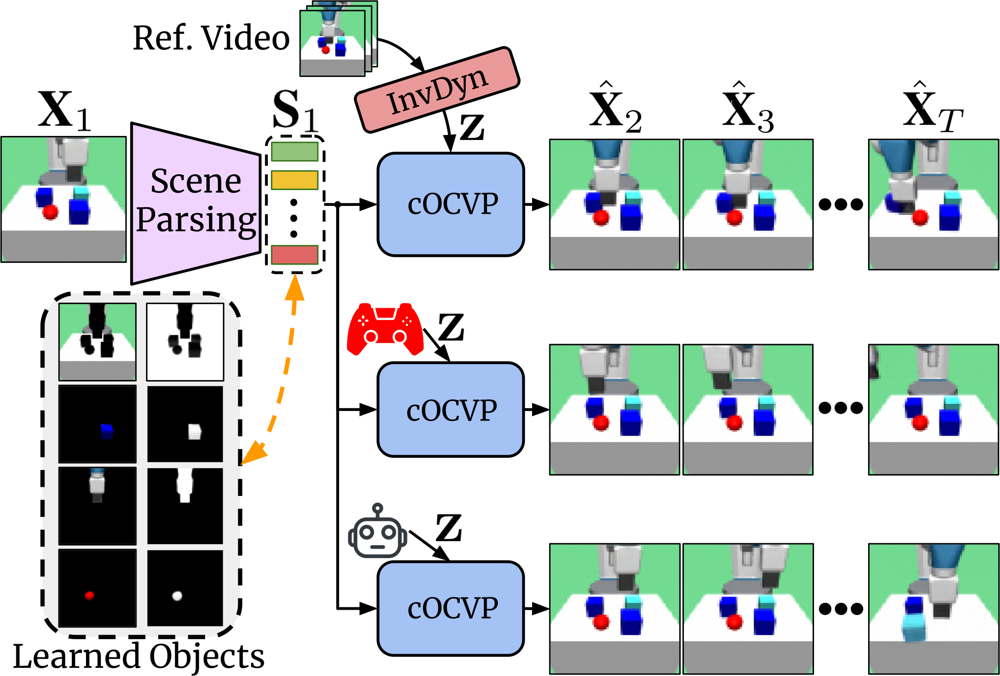<br>
    </td>
    <td align="center">
      <b>Target</b>
      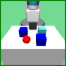
    </td>
    <td align="center">
      <b>Preds.</b>
      
    </td>
    <td align="center">
      <b>Segm.</b>
      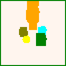
    </td>
    <td align="center">
      <b>Obj.1</b>
      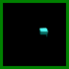
    </td>
    <td align="center">
      <b>Obj.2</b>
      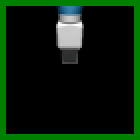
    </td>
  </tr>
  
  <tr>
    <td align="center">
      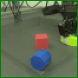
    </td>
    <td align="center">
      
    </td>
    <td align="center">
      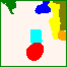
    </td>
    <td align="center">
      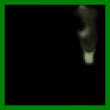
    </td>
    <td align="center">
      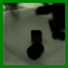
    </td>
  </tr>

</table>


## Installation and Dataset Preparation

1. Clone the repository and install all required packages including in our ```conda``` environment, as
well as other external dependencies, such as the [multi-object-fetch](https://github.com/maltemosbach/multi-object-fetch) environment or [MetaWorld](https://github.com/Farama-Foundation/Metaworld).
```
git clone git@github.com:angelvillar96/PlaySlot.git
cd PlaySlot
./create_conda_env.sh
source ~/.bashrc
conda activate PlaySlot
```


2. Download and extract the pretrained models, including checkpoints for the SAVi decomposition, predictor modules and behavior modules:
```
chmod +x download_pretrained.sh
./download_pretrained.sh
```


3. Download the datasets:

 - **ButtonPress:** Coming soon!

 - **BlockPush:** Coming soon!

 - **GridShapes:** Coming soon!

 - **Sketchy:** For downloading the Sketchy robot dataset, we refer to the [original source](https://github.com/google-deepmind/deepmind-research/tree/master/sketchy)
 


## Training

We refer to [docs/TRAIN.md](/assets/docs/TRAIN.md) for detailed instructions for training your own PlaySlot.
We include instractions for all training stages, including training SAVi, jointly training cOCVP and InvDyn, and learning behaviors from unlabelled expert demonstrations.


## Evaluation and Figure Generation

We provide bash scripts for evaluating and generating figures using our pretrained checkpoints. <br>
Simply run the bash scripts by:

```
./scripts/SCRIPT_NAME
```

**Example:**

```
./scripts/05_eval_PlaySlot_BlockPush.sh 
./scripts/06_generate_figs_pred_BlockPush.sh
./scripts/06_generate_action_figs_BlockPush.sh
```

Below we discuss more in detail the different evaluation and figure generation scripts and processes.


### Evaluate SAVi for Image Decomposition

You can quantitatively and qualitatively evaluate a SAVi video decomposition model using the `src/03_evaluate_savi.py` and `src/06_generate_figs_savi.py` scripts, respectively.

This scrips will evaluate the model on the test set and generate figures for the results.

**Example:**
```
python src/03_evaluate_savi.py \
  -d experiments/BlockPush/ \
  --savi_ckpt SAVi_BlockPush.pth \
  --results_name quant_eval_savi

python src/06_generate_figs_savi.py \
  -d experiments/BlockPush/ \
  --savi_ckpt SAVi_ButtonPress.pth \
  --num_seqs 10 \
  --num_frames 8
```

<details>
    <summary><i>Show SAVi Figures</i></summary>
    Generating figures with SAVi should produce figures as follows:
    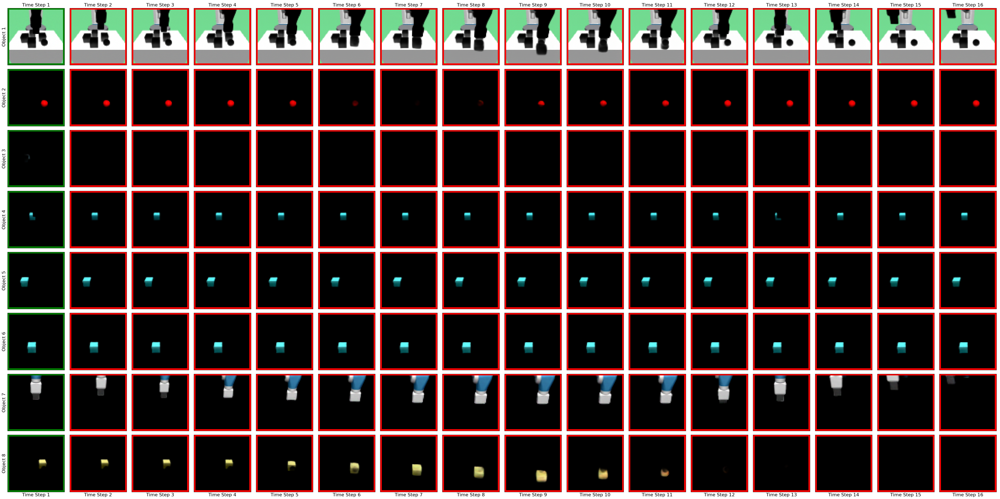
    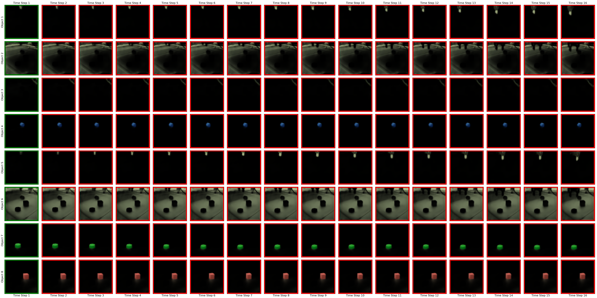
</details>


### Evaluate PlaySlot for Video Prediction

You can evaluate PlaySlot for video prediction using the `src/05_evaluate_PlaySlot.py` script.
This script takes a pretrained SAVi and PlaySlot checkpoints and evaluates the visual quality of the predicted frames.

**Example:**
```
python src/05_evaluate_PlaySlot.py \
  -d experiments/BlockPush/ \
  --name_pred_exp PlaySlot \
  --savi_ckpt SAVi_BlockPush.pth \
  --pred_ckpt PlaySlot_BlockPush.pth \
  --results_name quant_eval_playslot \
  --post_only \
  --num_seed 6 \
  --num_preds 15 \
  --set_expert_policy
```


### Generate Figures and Animations

We provide two scripts to generate video prediction, object prediction, and segmentation figures and animations.


 1. `src/06_generate_figs_pred.py` generates images and animations of frames, objects and slot masks predicted by PlaySlot
 conditioned on latent actions inferred by the Inverse Dynamics model.


**Example:**
```
python src/06_generate_figs_pred.py \
  -d experiments/BlockPush/ \
  --name_pred_exp PlaySlot \
  --savi_ckpt SAVi_BlockPush.pth \
  --pred_ckpt PlaySlot_BlockPush.pth \
  --num_seqs 10 \
  --num_seed 1 \
  --num_preds 15 \
  --set_expert_policy
```


<details>
    <summary><i>Show Example Outputs of `src/06_generate_figs_pred.py`</i></summary>
    Generating figures with PlaySlot should produce animations as follows:
    <br>
    </table>
      <tbody>
      <tr>
        <td align="center">
          
        </td>
        <td align="center">
          
        </td>
        <td align="center">
          
        </td>
        <td align="center">
          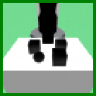
        </td>
        <td align="center">
          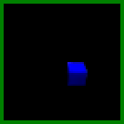
        </td>
        <td align="center">
          
        </td>
        <td align="center">
          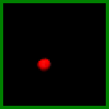
        </td>
        <td align="center">
          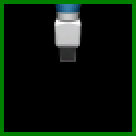
        </td>
      </tr>
      <br>
      <tr>
        <td align="center">
          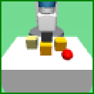
        </td>
        <td align="center">
          
        </td>
        <td align="center">
          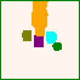
        </td>
        <td align="center">
          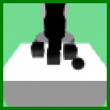
        </td>
        <td align="center">
          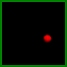
        </td>
        <td align="center">
          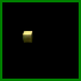
        </td>
        <td align="center">
          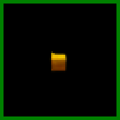
        </td>
        <td align="center">
          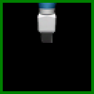
        </td>
      </tr>
      </tbody>
    </table>
</details>


 2. `src/06_generate_action_figs.py` generates images and animations of frames generated by PlaySlot 
 by repeatedly conditioning the predition process on a single learned action prototype.


**Example:**
```
python src/06_generate_action_figs.py \
  -d experiments/BlockPush/ \
  --name_pred_exp PlaySlot \
  --savi_ckpt SAVi_BlockPush.pth \
  --pred_ckpt PlaySlot_BlockPush.pth \
  --num_seqs 10 \
  --num_seed 1 \
  --num_preds 15 \
  --set_expert_policy
```


<details>
     <summary><i>Show Example Outputs of `src/06_generate_action_figs.py`</i></summary>
    Generating figures with this script should produce animations as follows:
    <br>
    </table>
      <tr>
        <td align="center">
          
        </td>
        <td align="center">
          
        </td>
        <td align="center">
          
        </td>
        <td align="center">
          
        </td>
        <td align="center">
          
        </td>
        <td align="center">
          
        </td>
        <td align="center">
          
        </td>
        <td align="center">
          
        </td>
      </tr>
      <br>
      <tr>
        <td align="center">
          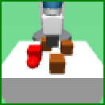
        </td>
        <td align="center">
          
        </td>
        <td align="center">
          
        </td>
        <td align="center">
          
        </td>
        <td align="center">
          
        </td>
        <td align="center">
          
        </td>
        <td align="center">
          
        </td>
        <td align="center">
          
        </td>
      </tr>
    </table>
</details>


### Evaluate Behaviors Learned by PlaySlot

You can quantitatively and qualitatively evaluate PlaySlot's behaviors using the `src/11_evaluate_behavior_on_simulation.py`.
This scrips will evaluate the model using a simulator and generate figures for the results.


**Example:**
```
python src/11_evaluate_behavior_on_simulation.py \
  -d experiments/zz_Clean/Final_00/ \
  --savi_ckpt checkpoint_epoch_440.pth \
  --name_pred_exp NewSlotLatent \
  --pred_ckpt checkpoint_epoch_800.pth \
  --name_beh_exp zzBehn \
  --beh_ckpt Policy_checkpoint_last_saved.pth \
  --seed 1000 \
  --num_sims 10
```


<details>
    <summary><i>Show Example Outputs of `src/11_evaluate_behavior_on_simulation.py`</i></summary>
    Generating figures of PlaySlot's learned behaviors should produce animations as follows:
    <br>
    <br>
    </table>
      <tr>
        <td align="center">
          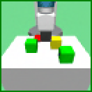
        </td>
        <td align="center">
          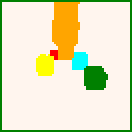
        </td>
        <td align="center">
          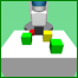
        </td>
      </tr>
      <br>
      <tr>
        <td align="center">
          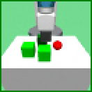
        </td>
        <td align="center">
          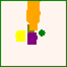
        </td>
        <td align="center">
          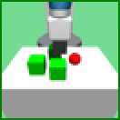
        </td>
      </tr>
    </table>
</details>


## Acknowledgement

Our work is inspired and uses resources from the following repositories:
 - [SlotFormer](https://github.com/pairlab/SlotFormer)
 - [OCVP](https://github.com/AIS-Bonn/OCVP-object-centric-video-prediction)
 - [SOLD](https://github.com/maltemosbach/sold)
 - [SAVi-pytorch](https://github.com/junkeun-yi/SAVi-pytorch)
 - [Multi-Object-Fetch](https://github.com/maltemosbach/multi-object-fetch)


## Contact and Citation

This repository is maintained by [Angel Villar-Corrales](http://angelvillarcorrales.com/templates/home.php).


Please consider citing our paper if you find our work or our repository helpful.

```
@article{villar_PlaySlot_2025,
  title={PlaySlot: Learning Inverse Latent Dynamics for Controllable Object-Centric Video Prediction and Planning},
  author={Villar-Corrales, Angel and Behnke, Sven},
  journal={arXiv preprint arXiv:2502.07600},
  year={2025}
}
```

In case of any questions or problems regarding the project or repository, do not hesitate to contact the authors at `villar@ais.uni-bonn.de`.
