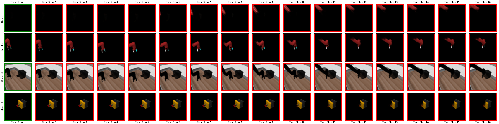

# Training

We provide our entire pipeline for training PlaySlot.
This process happens in three different stages:
 1. Training SAVi for object-centric video decomposition
 2. Training PlaySlot prediction and inverse dynamics models for predicting future slots and inferring latent actions
 3. (Optional) Training Policy model and Action Decoder to learn a behavior from the latent actions.


## 1. Train SAVi Video Decomposition Model

**1.** Create a new experiment using the `src/01_create_experiment.py` script. This will create a new experiments folder in the `/experiments` directory.

```
usage: 01_create_experiment.py [-h] -d EXP_DIRECTORY [--name NAME] [--dataset_name DATASET_NAME]

optional arguments:
  -h, --help            show this help message and exit
  -d EXP_DIRECTORY, --exp_directory EXP_DIRECTORY
                        Directory where the experimentfolder will be created
  --name NAME           Name to give to the experiment
  --dataset_name DATASET_NAME
                        Dataset name to keep in the exp_params: ['GridShapes', 'MetaWorld', 'MetaworldExpertPolicies', 'RobotDataset', 'RobotDatasetExpertPolicies', 'Sketchy']
```


**2.** Modify the experiment parameters located in `experiments/YOUR_EXP_DIR/YOUR_EXP_NAME/experiment_params.json` to adapt to your dataset and training needs.


**3.** Train SAVi given the specified experiment parameters:

```
usage: 02_train_savi.py [-h] -d EXP_DIRECTORY [--checkpoint CHECKPOINT] [--resume_training]

optional arguments:
  -d EXP_DIRECTORY, --exp_directory EXP_DIRECTORY
                        Path to the experiment directory
  --checkpoint CHECKPOINT
                        Checkpoint with pretrained parameters to load
  --resume_training     For resuming training
```

You can visualize the training progress in the Tensorboard.
```
tensorboard --logdir experiments/YOUR_EXP_DIR/YOUR_EXP_NAME/ --port TBOARD_PORT
```


#### Example: SAVi Training

Below we provide an example of how to train a new SAVi model:

```
python src/01_create_experiment.py \
    -d experiments \
    --name my_exp \
    --dataset_name Sketchy

python src/02_train_savi.py \
    -d experiments/my_exp
```

<details>
    <summary><i>Show SAVi training results</i></summary>
    A correctly trained SAVi model learns to parse a video sequence into meaningful object components,
    which are represented consistently by the same slot across time.
    Examples of SAVi models pre-trained for different datasets are shown below:
     <br>
    <br>
    
    <br>
    <br>
    
</details>


## 2. Training the Object-Centric Predictor and Inverse Dynamics Modules

Training an object-centric video prediction model, and its corresponding Inverse Dynamics module, requires having a pretrained SAVi 
decomposition model.
You can use either our provided pretrained models, or you can train your own SAVi video decomposition models.


**1.** Create a new predictor experiment using the `src/src/01_create_predictor_experiment.py` script. This will create a new predictor folder in the specified experiment directory.

```
usage: 01_create_predictor_experiment.py [-h] -d EXP_DIRECTORY --name NAME --predictor_name {ActionCondOCVP,OCVPSeq,SlotLatentPredictor,SlotSingleAction,VanillaTransformer}

optional arguments:
  -h, --help            show this help message and exit
  -d EXP_DIRECTORY, --exp_directory EXP_DIRECTORY
                        SAVi experiment directory where the predictor exp. will be created
  --name NAME           Name to give to the predictor experiment
  --predictor_name {ActionCondOCVP,OCVPSeq,SlotLatentPredictor,SlotSingleAction,VanillaTransformer}
                        Name of the predictor module to use: ['ActionCondOCVP', 'OCVPSeq', 'SlotLatentPredictor', 'SlotSingleAction', 'VanillaTransformer']
```


**2.** Modify the experiment parameters located in `experiments/YOUR_EXP_DIR/YOUR_EXP_NAME/predictors/YOUR_PREDICTOR_NAME/experiment_params.json` to adapt the predictor training parameters to your training needs.


 **3.** Train the Object-Centric Predictor (cOCVP) and Inverse-Dynamics (InvDyn) modules given the specified experiment parameters and a pretrained SAVi model:

 ```
usage: 04_train_PlaySlot.py [-h] -d EXP_DIRECTORY --savi_ckpt SAVI_CKPT --name_pred_exp NAME_PRED_EXP [--checkpoint CHECKPOINT] [--resume_training]

optional arguments:
  -h, --help            show this help message and exit
  -d EXP_DIRECTORY, --exp_directory EXP_DIRECTORY
                        Path to the SAVi exp. directory. It includes the predictor exp.
  --savi_ckpt SAVI_CKPT
                        Name of the pretrained SAVi checkpoint to use
  --name_pred_exp NAME_PRED_EXP
                        Name to the predictor experiment to train.
  --checkpoint CHECKPOINT
                        Checkpoint with predictor pretrained parameters to load
  --resume_training     Resuming training
 ```


#### Example: Predictor Training

Below we provide an example of how to train an object-centric predictor given a pretrained SAVi model. This example continues the example above

```
python src/01_create_predictor_experiment.py \
  -d experiments/my_exp \
  --name my_PlaySlot_Exp \
  --predictor_name SlotSingleAction

python src/04_train_PlaySlot.py \
  -d experiments/my_exp
  --savi_ckpt checkpoint_epoch_final.pth
  --name_pred_exp my_PlaySlot_Exp
```


<details>
    <summary><i>Show PlaySlot Predictor & InvDyn training results</i></summary>
    A successfully trained PlaySlot Predictor & InvDyn model will produce the following results:
    
    <br>
    <br>
    
    <br>
    <br>
    
</details>


## 3. Learning Behaviors from Expert Demonstration

Given a pretrained SAVi decomposition mode, PlaySlot predictor and inverse dynamics model,
we can now trained a policy model and action decoder to learn behaviors from expert demonstrations.


**1.** Create a new behavior experiment using the `src/src/01_create_policy_experiment.py` script.
This will create a new behaviors folder in the specified predictor experiment directory.

```
usage: 01_create_policy_experiment.py [-h] -d EXP_DIRECTORY --name NAME

optional arguments:
  -h, --help            show this help message and exit
  -d EXP_DIRECTORY, --exp_directory EXP_DIRECTORY
                        Predictor exp. directory where the behavior exp. will be created
  --name NAME           Name to give to the behavior experiment
```


**2.** Modify the experiment parameters located in `experiments/YOUR_EXP_DIR/YOUR_EXP_NAME/predictors/YOUR_PREDICTOR_NAME/behaviors/YOUR_BEHAVIOR_NAME/experiment_params.json` to adapt the training parameters to your training needs.


 **3.** Train the Policy Model and Action Decoder modules given the specified experiment parameters and a pretrained decomposition, prediction, and inverse dynamics modules:

 ```
usage: 10_learn_behavior_from_demos.py [-h] -d EXP_DIRECTORY --savi_ckpt SAVI_CKPT --name_pred_exp NAME_PRED_EXP --pred_ckpt PRED_CKPT --name_beh_exp NAME_BEH_EXP [--num_expert_demos NUM_EXPERT_DEMOS]

optional arguments:
  -h, --help            show this help message and exit
  -d EXP_DIRECTORY, --exp_directory EXP_DIRECTORY
                        Path to the father SAVi exp. directory
  --savi_ckpt SAVI_CKPT
                        Name of the pretrained SAVi checkpoint to use
  --name_pred_exp NAME_PRED_EXP
                        Name of the predictor exp_directory.
  --pred_ckpt PRED_CKPT
                        Name of the pretrained PlaySlot predictor checkpoint to load
  --name_beh_exp NAME_BEH_EXP
                        Name of the behavior experiment to train.
  --num_expert_demos NUM_EXPERT_DEMOS
                        Number of expert demos to use for training. -1 mean 'use all'
 ```


#### Example: Learning Behaviors

Below we provide an example of how to train a Policy Model and Action Decoder given a pretrained SAVi and PlaySlot model.
This example continues the example above.

```
python src/01_create_policy_experiment.py \
  -d experiments/my_exp/predictors/my_PlaySlot_Exp \
  --name my_PolicyExp \

python src/10_learn_behavior_from_demos.py \
  -d experiments/my_exp \
  --savi_ckpt checkpoint_epoch_final.pth \
  --name_pred_exp my_PlaySlot_Exp \
  --pred_ckpt checkpoint_epoch_final.pth \
  --name_beh_exp my_PolicyExp
```


<details>
    <summary><i>Show Examples of a Learned Behavior</i></summary>
    A successfully trained Policy Model and Action Decoder will produce the following results:
    <br>
    <br>
    </table>
      <tr>
        <td align="center">
          
        </td>
        <td align="center">
          
        </td>
        <td align="center">
          
        </td>
      </tr>
      <br>
      <tr>
        <td align="center">
          
        </td>
        <td align="center">
          
        </td>
        <td align="center">
          
        </td>
      </tr>
    </table>
</details>


## Further Comments

 - You can download our experiments directory, including the experiment parameters and pretrained 
 checkpoints by running the following script:
  ```
  chmod +x download_pretrained.sh
  ./download_pretrained.sh
  ```


 - The training can be monitored using Tensorboard.
   To launch tensorboard,
  
  ```
  tensorboard --logdir experiments/EXP_DIR/EXP_NAME --port 8888
  ```

 - In case of questions, do not hesitate to open an issue or contact the authors at `villar@ais.uni-bonn.de`
